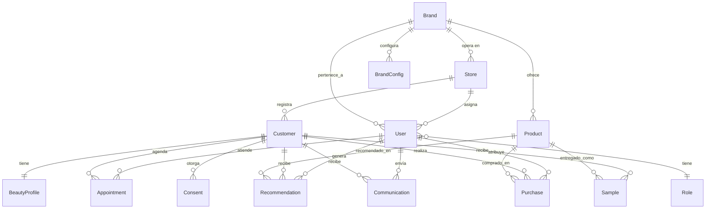

# 02 — Modelo de Dominio

Este documento define las entidades del sistema, sus relaciones y las reglas de negocio que operan sobre ellas. Es la fuente de verdad para cualquier cambio en el schema de base de datos, para la implementación del motor de IA y para el diseño de las interfaces.

La implementación concreta del schema vive en `/packages/database/schema/`. Este documento describe el **qué** y el **por qué**; el cómo vive en código.

## Diagrama de entidades



## Entidades principales

Cada entidad lista sus campos clave y referencia los requerimientos funcionales que la justifican. Los campos de timestamps (`created_at`, `updated_at`) y el `id` UUID se omiten por ser universales.

### Brand

Representa una marca del portafolio L'Oréal (Lancôme, Kiehl's, YSL Beauty, Maybelline, L'Oréal Paris, etc.).

**Campos clave**:
- `code` (único, ej: "LANCOME")
- `display_name`
- `tier` (luxury / premium / mass)
- `active`

**Requerimientos que cumple**: RNF-13 (multi-marca con configuración independiente).

**Nota crítica**: La separación por marca es **aislamiento de datos fuerte**, no solo cosmético. Marcas competidoras dentro del portafolio (ej: Lancôme vs L'Oréal Paris en fragancia) no deben ver datos la una de la otra.

### BrandConfig

Configuración independiente por marca (UI, plantillas, tono de voz, categorías, reglas de reposición específicas).

**Campos clave**:
- `brand_id`
- `primary_color`, `secondary_color`, `accent_color`
- `logo_url`
- `font_family`
- `message_templates` (JSON) — plantillas de WhatsApp personalizadas (RF-36)
- `replenishment_rules` (JSON) — ajustes de la lógica de reposición por categoría
- `virtual_tryon_enabled` (RF-63)

**Requerimientos que cumple**: RNF-13, RNF-16 (configuración gestionable sin dependencia del proveedor).

### Store

Punto de venta físico. Puede ser una tienda Liverpool, Palacio, o boutique propia.

**Campos clave**:
- `code` (único, ej: "PDH_POLANCO")
- `display_name`
- `chain` (enum: `liverpool`, `palacio`, `owned`)
- `zone_id` (agrupa tiendas bajo un supervisor)
- `address`, `city`, `state`
- `active`

**Requerimientos que cumple**: RNF-14 (multi-tienda con configuraciones independientes).

### Zone

Agrupación de tiendas bajo responsabilidad de un Supervisor.

**Campos clave**:
- `code`
- `display_name`
- `region` (ej: "Metropolitana Norte")

**Requerimientos que cumple**: RF-54 (supervisor ve resultados de múltiples tiendas).

### User

Usuario interno del sistema. Puede ser BA, Gerente de Tienda, Supervisor de Zona o Administrador Central.

**Campos clave**:
- `email` (único, para login)
- `full_name`
- `role` (enum: `ba`, `manager`, `supervisor`, `admin`)
- `store_id` (nullable; admin no tiene tienda; supervisor opera por zona)
- `zone_id` (nullable; solo supervisor)
- `brand_id` (nullable; BA y gerente pertenecen a una marca específica)
- `active`
- `last_login_at`

**Requerimientos que cumple**: RF-51 a RF-56 (roles diferenciados con scope específico).

**Scope de datos por rol** (fuente de verdad para Sync Rules de PowerSync y guards del API):

| Rol | Puede ver | No puede ver |
|---|---|---|
| BA | Clientes y datos de SU tienda y marca | Datos de otras tiendas o marcas |
| Gerente | Todos los BAs y clientes de SU tienda | Datos de otras tiendas |
| Supervisor | Agregados de tiendas de SU zona | Datos personales granulares de clientes fuera de zona |
| Admin | Todo a nivel nacional | — |

### Customer

La clienta final. Sujeto principal de los datos. **No es usuario del sistema**, pero es sobre quien se construye todo el valor.

**Campos clave**:
- `first_name`, `last_name`
- `email` (opcional, único si existe)
- `phone` (opcional, único si existe)
- `gender` (enum: `female`, `male`, `non_binary`, `prefer_not_say`) (RF-01)
- `birth_date`
- `age_range` (calculado)
- `registered_at_store_id`
- `registered_by_user_id` (BA que la registró)
- `last_ba_user_id` (último BA que la atendió)
- `customer_since`
- `last_contact_at`
- `last_transaction_at`
- `lifecycle_segment` (enum: `new`, `returning`, `vip`, `at_risk`) — calculado automáticamente (RF-11)

**Requerimientos que cumple**: RF-01, RF-03, RF-04, RF-11, RF-43.

**Privacidad**: esta entidad contiene PII sensible. Todo acceso se registra en `AuditLog`. El derecho al olvido (RNF-05) implica **hard delete** de esta fila y anonimización en tablas relacionadas.

### BeautyProfile

Perfil de belleza asociado a una clienta. Relación 1:1 con Customer pero separada porque tiene su propio ciclo de vida y es opcional en el registro inicial.

**Campos clave**:
- `customer_id`
- `skin_type` (enum: `dry`, `oily`, `combination`, `sensitive`, `normal`)
- `skin_tone` (enum: `fair`, `light`, `medium`, `tan`, `deep`)
- `skin_subtone` (enum: `cool`, `neutral`, `warm`)
- `skin_concerns` (array: `acne`, `aging`, `pigmentation`, `dryness`, etc.)
- `preferred_ingredients` (array)
- `avoided_ingredients` (array) — alergias, preferencias
- `fragrance_preferences` (array: `floral`, `woody`, `citrus`, etc.)
- `makeup_preferences` (JSON)
- `routine_type` (enum: `morning`, `night`, `both`)
- `interests` (array: `skincare`, `makeup`, `fragrance`)

**Shade history** (tabla separada `BeautyProfileShade`):
- `beauty_profile_id`
- `category` (enum: `foundation`, `concealer`, `lipstick`, `blush`)
- `brand_id` (qué marca)
- `product_id` (qué producto exacto)
- `shade_code`
- `captured_at`
- `captured_by_user_id`

**Requerimientos que cumple**: RF-05, RF-07, RF-58, RF-60.

### Product

Producto del catálogo. Se replica (o se refiere) desde los sistemas de L'Oréal. En el proyecto universitario se seedeéa con datos realistas.

**Campos clave**:
- `sku` (único global)
- `brand_id`
- `name`
- `category` (enum: `skincare`, `makeup`, `fragrance`)
- `subcategory` (ej: `foundation`, `serum`, `eau_de_parfum`)
- `description`
- `ingredients` (array)
- `price` (MXN)
- `images` (array de URLs en S3)
- `shade_options` (JSON, si aplica)
- `estimated_duration_days` (para reposición, RF-16)
- `technical_sheet_url` (RF-62)
- `tutorial_url` (RF-62)
- `sales_argument` (texto, RF-62)
- `embedding` (vector pgvector, para búsqueda semántica)
- `active`

**Requerimientos que cumple**: RF-14, RF-17, RF-62.

**Availability** (tabla separada `ProductAvailability`):
- `product_id`
- `store_id`
- `stock_status` (enum: `available`, `low`, `out_of_stock`)
- `last_synced_at`

### Recommendation

Registro de una recomendación de producto hecha por un BA a una clienta.

**Campos clave**:
- `customer_id`
- `product_id`
- `ba_user_id`
- `store_id`
- `recommended_at`
- `source` (enum: `manual`, `ai_suggested`, `replenishment_alert`)
- `ai_reasoning` (texto, si `source = ai_suggested`) — explicación generada por Claude
- `notes` (texto libre del BA)
- `visit_reason` (enum: `new_purchase`, `rebuy`, `gift`, `concern`, `promotion`, `browsing`) — RF-06
- `converted_to_purchase` (boolean, se actualiza cuando se registra una compra del mismo producto)
- `conversion_purchase_id` (nullable, FK a Purchase)

**Requerimientos que cumple**: RF-06, RF-13, RF-15, RF-19, RF-47.

### Purchase

Registro de una compra realizada por una clienta.

**Campos clave**:
- `customer_id`
- `store_id`
- `purchased_at`
- `total_amount` (MXN)
- `pos_transaction_id` (si vino del POS integrado; null si es manual)
- `source` (enum: `pos_integration`, `manual`, `ecommerce`) — RF-22, RF-23
- `attributed_ba_user_id` (RF-25) — BA a quien se atribuye la venta
- `attribution_reason` (enum: `last_consultation`, `active_recommendation`, `direct_assistance`)

**PurchaseItem** (tabla separada):
- `purchase_id`
- `product_id`
- `sku`
- `quantity`
- `unit_price`

**Requerimientos que cumple**: RF-20, RF-21, RF-22, RF-23, RF-24, RF-25.

### Sample

Registro de una muestra entregada por el BA a la clienta.

**Campos clave**:
- `customer_id`
- `product_id`
- `ba_user_id`
- `store_id`
- `delivered_at`
- `converted_to_purchase` (boolean)
- `conversion_purchase_id` (nullable)

**Requerimientos que cumple**: RF-08, RF-61.

### Appointment

Cita entre clienta y BA para servicios de mostrador, faciales, cabina, etc.

**Campos clave**:
- `customer_id`
- `ba_user_id`
- `store_id`
- `event_type` (enum configurable: `cabin_service`, `facial`, `anniversary_event`, `vip_cabin`, `product_followup`, `custom`) — RF-29
- `scheduled_at`
- `duration_minutes`
- `status` (enum: `scheduled`, `confirmed`, `rescheduled`, `cancelled`, `completed`, `no_show`)
- `comments`
- `reminder_sent_at` (RF-30)
- `confirmation_sent_at` (RF-31)
- `is_virtual` (RF-33)
- `video_link` (nullable)
- `rescheduled_from_appointment_id` (nullable, para trazabilidad de RF-32)

**Requerimientos que cumple**: RF-26 a RF-33.

### Communication

Registro de comunicación enviada al cliente (WhatsApp, SMS, email).

**Campos clave**:
- `customer_id`
- `sent_by_user_id`
- `channel` (enum: `whatsapp`, `sms`, `email`)
- `template_id` (nullable, FK a MessageTemplate si se usó una)
- `subject` (nullable, solo email)
- `body`
- `followup_type` (enum: `3_months`, `6_months`, `birthday`, `replenishment`, `special_event`, `custom`) — RF-38
- `sent_at`
- `delivered_at`
- `read_at`
- `responded_at`
- `tracking_link_id` (nullable, para RF-39 atribución de ventas online)

**Requerimientos que cumple**: RF-34, RF-35, RF-37, RF-38, RF-39.

### MessageTemplate

Plantilla de mensaje configurable por marca.

**Campos clave**:
- `brand_id` (nullable = template global)
- `name`
- `channel`
- `body` (con placeholders `{{customer.first_name}}`, `{{product.name}}`, etc.)
- `followup_type`
- `active`

**Requerimientos que cumple**: RF-36.

### Consent

Registro de consentimientos otorgados por la clienta.

**Campos clave**:
- `customer_id`
- `type` (enum: `privacy_notice`, `marketing_sms`, `marketing_email`, `marketing_whatsapp`)
- `version` (del aviso de privacidad, RF-02)
- `accepted_at`
- `revoked_at` (nullable)
- `source` (dónde se capturó)
- `ip_address` (opcional, para auditabilidad)

**Requerimientos que cumple**: RF-02, RNF-07.

**Nota crítica**: los consentimientos son por canal, no globales. Una clienta puede aceptar WhatsApp pero no email. La plataforma debe respetar esto al enviar comunicaciones.

### AuditLog

Registro inmutable de acciones sensibles para cumplimiento LFPDPPP.

**Campos clave**:
- `actor_user_id` (quién hizo la acción; null si fue sistema)
- `action` (enum: `customer_viewed`, `customer_exported`, `customer_deleted`, `consent_granted`, `consent_revoked`, `role_changed`, etc.)
- `entity_type` (ej: `customer`, `purchase`)
- `entity_id`
- `changes` (JSON, diff de qué cambió)
- `ip_address`
- `user_agent`
- `timestamp`

**Requerimientos que cumple**: RNF-04, RNF-05.

**Característica**: esta tabla es **append-only**. Nunca se borran registros. Incluso cuando se ejerce derecho al olvido sobre una clienta, los AuditLogs relacionados se preservan con el `entity_id` pero sin referenciar PII de la clienta borrada.

## Reglas de negocio críticas

Las siguientes reglas son **lógica de dominio pura** que vive en `/packages/domain/`. Se testea en aislamiento y se usa desde el API (NestJS) y el servicio de IA (FastAPI, con lógica replicada si es necesario).

### Segmentación automática del ciclo de vida (RF-11)

Se recalcula diariamente (cron job nocturno) y en eventos específicos (nueva compra, visita registrada).

**Reglas**:

- `new`: registrada hace menos de 30 días sin segunda visita.
- `returning`: entre 2 y 5 transacciones en los últimos 12 meses.
- `vip`: ≥ 6 transacciones en últimos 12 meses **o** spending total > umbral por marca (configurable en BrandConfig).
- `at_risk`: última transacción entre 120 y 365 días atrás, sin comunicación de seguimiento reciente.
- Si última transacción > 365 días sin respuesta a seguimientos: segment permanece en `at_risk` pero se marca `inactive = true`.

### Lógica de reposición (RF-16)

Objetivo: estimar cuándo la clienta va a acabar un producto comprado y alertar al BA para proponer recompra.

**Algoritmo**:

1. Para cada compra, se tiene `purchased_at` y `product.estimated_duration_days` (parametrizado por producto, configurable).
2. Fecha estimada de agotamiento: `purchased_at + estimated_duration_days`.
3. Ventana de recompra sugerida: 15 días antes de agotamiento hasta 30 días después.
4. Si hoy está en esa ventana, se genera una alerta de reposición para el BA (RF-09).
5. Si se detectan múltiples compras históricas del mismo producto, se puede promediar el intervalo real de recompra de esa clienta específica para afinar la predicción.

**Ajustes por categoría** (en BrandConfig):

- Skincare: duración base por SKU.
- Fragancias: mayor variabilidad; el sistema confía menos en la estimación y más en eventos (cumpleaños, aniversarios).
- Maquillaje de alto consumo (base, máscara): duración media clara.
- Productos de uso esporádico (labiales especiales): no se genera alerta.

### Atribución de venta al BA (RF-25)

Regla de atribución cuando llega una compra desde el POS:

1. Si existe una `Recommendation` activa (últimos 30 días) del mismo `product_id` para la misma `customer_id`, se atribuye al BA que la hizo.
2. Si no, si hubo una consulta (`last_ba_user_id` se registró en Customer) en las últimas 24 horas, se atribuye a ese BA.
3. Si no, la compra queda sin atribución (null).

Cada compra atribuida actualiza el campo `converted_to_purchase = true` en la `Recommendation` correspondiente.

### Eventos de vida automáticos (RF-09)

Cron job diario genera alertas para el BA cuando:

- Cumpleaños de la clienta está dentro de los próximos 7 días.
- Aniversario como clienta (basado en `customer_since`) está dentro de los próximos 7 días.
- Período estimado de reposición (ver regla anterior) está dentro de la ventana.

Estas alertas aparecen en el dashboard del BA al iniciar sesión y se sincronizan offline.

### Derecho al olvido (RNF-05)

Flujo cuando una clienta solicita eliminación de sus datos:

1. Solicitud llega vía canal formal (admin la registra manualmente o sistema de autoservicio en fase futura).
2. Sistema valida identidad de la solicitante.
3. Ejecuta transacción de base de datos:
   - **Hard delete**: `Customer`, `BeautyProfile`, `BeautyProfileShade`, `Consent`.
   - **Anonimización**: en `Purchase`, `Recommendation`, `Sample`, `Communication`, `Appointment` se reemplaza `customer_id` por un ID genérico "deleted_customer" pero se preservan montos, atribuciones y métricas.
   - **Preservación**: `AuditLog` se mantiene intacto, solo se remueven campos de PII dentro del campo `changes`.
4. Se registra la eliminación en `AuditLog` con `action = 'customer_deleted_gdpr_request'`.
5. Se genera constancia de eliminación en PDF (con folio) que el admin puede entregar a la clienta.

**Nota**: este flujo satisface tanto derecho al olvido LFPDPPP como buena práctica para retención de métricas agregadas (un VIP que borra sus datos no debe invalidar los reportes históricos de ventas).

### Búsqueda de clientes (RF-03)

Tres tipos de búsqueda, en orden de prioridad:

1. **Exacta por email o teléfono**: retorno directo si hay match único.
2. **Por nombre**: full-text search en Postgres sobre `first_name + last_name`, ordenado por última interacción con el BA que busca (suele ser "la clienta que acabo de atender la semana pasada").
3. **Por tono/preferencias** (búsqueda semántica usando embeddings de `BeautyProfile`): útil cuando el BA recuerda características pero no el nombre.

El scope de la búsqueda está **limitado por el rol del usuario** (RF-52). Un BA solo busca dentro de clientes de su tienda.

## Configuración multi-tenant

La plataforma es multi-marca y multi-tienda. La arquitectura refleja esto en tres niveles:

### Nivel de datos (aislamiento lógico)

- Row Level Security en Postgres filtra por `brand_id` y `store_id` según el rol del usuario autenticado.
- Las Sync Rules de PowerSync replican este filtrado al SQLite local del mobile.
- El API aplica guards de CASL que verifican permisos antes de tocar datos.

### Nivel de UI (personalización por marca)

- La app mobile y el panel web leen `BrandConfig` para aplicar colores, logo, tipografía.
- Plantillas de WhatsApp se resuelven a la de la marca correspondiente.
- En el panel admin, se puede alternar entre marcas si el usuario tiene permisos cross-brand.

### Nivel de configuración (gestionable sin desarrollo, RNF-16)

- Crear una marca nueva: insertar row en `Brand` + `BrandConfig`. Sin código.
- Crear una tienda nueva: insertar row en `Store`, asignar a una zona. Sin código.
- Crear un tipo de evento de cita nuevo (RF-29): insertar row en enum dinámico o tabla `EventType`.
- Modificar plantillas de mensajes: editar `MessageTemplate` vía panel admin.

## Diagrama resumido de flujo de datos

```
BA escanea SKU en iPad
         │
         ▼
SQLite local (PowerSync)
         │  
         │ (cuando hay red)
         ▼
PowerSync Service
         │
         ▼
Postgres (RDS México)
         │
         ├──► NestJS API ──► Cálculo de atribución, audit log
         │
         └──► FastAPI AI  ──► Genera recomendación basada en perfil
                     │
                     ▼
              Claude API (anonimizado)
                     │
                     ▼
              Respuesta con razonamiento
                     │
                     ▼
              Persiste en Postgres
                     │
                     ▼
              PowerSync propaga al iPad
                     │
                     ▼
              BA ve la recomendación en la UI
```

## Referencias cruzadas

- Implementación del scope por rol en PowerSync: ver `05-offline-sync.md` sección "Sync Rules".
- Implementación del scope por rol en el API: ver `04-security-compliance.md` sección "RBAC".
- Detalle de cada entidad contra los RF: ver `06-rfp-compliance-matrix.md`.
